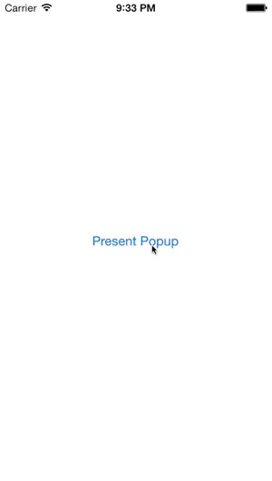
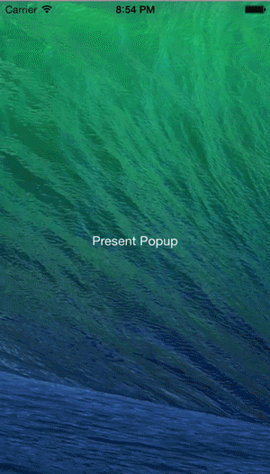

# CWPopup Category

CWPopup is a category on UIViewController that allows you to easily make popup view controllers.

## Fade

## Blur

## Installation

### [CocoaPods](http://www.cocoapods.org)

`pod 'CWPopup', '~> 1.2.4'`

### Manual

Import the directory `CWPopup` into your project. It contains the UIViewController categories.

### Requirements

* ARC
* iOS 4.3

## Usage
First of all, import the category.

    #import "UIViewController+CWPopup.h"

You can choose to use either a fade background or a blurred background. The fade background will partially fade out the background, whereas the blurred background will apply a blur to the background. **Note:** No background animations will show if you use the blurred background as it is a static image placed on top of the view. The default setting is to use the fade background. To enable the blurred background, in your `viewDidLoad` function, add the following line of code:

    self.useBlurForPopup = YES;

**NOTE:** Blur is only available in iOS 7+.

To present a view controller:

    SamplePopupViewController *samplePopupViewController = [[SamplePopupViewController alloc] initWithNibName:@"SamplePopupViewController" bundle:nil];
    [self presentPopupViewController:samplePopupViewController animated:YES completion:nil];

To dismiss a view controller:

    if (self.popupViewController != nil) {
        [self dismissPopupViewControllerAnimated:YES completion:nil];
    }

That's all there is to it.

**Note:** The background is not faded out if `animated` is set to `NO` - that way, if you want to implement your own animation and fading, you can.

## License

    The MIT License (MIT)

    Copyright (c) 2013 Cezary Wojcik <http://www.cezarywojcik.com>

    Permission is hereby granted, free of charge, to any person obtaining a copy
    of this software and associated documentation files (the "Software"), to deal
    in the Software without restriction, including without limitation the rights
    to use, copy, modify, merge, publish, distribute, sublicense, and/or sell
    copies of the Software, and to permit persons to whom the Software is
    furnished to do so, subject to the following conditions:

    The above copyright notice and this permission notice shall be included in
    all copies or substantial portions of the Software.

    THE SOFTWARE IS PROVIDED "AS IS", WITHOUT WARRANTY OF ANY KIND, EXPRESS OR
    IMPLIED, INCLUDING BUT NOT LIMITED TO THE WARRANTIES OF MERCHANTABILITY,
    FITNESS FOR A PARTICULAR PURPOSE AND NONINFRINGEMENT. IN NO EVENT SHALL THE
    AUTHORS OR COPYRIGHT HOLDERS BE LIABLE FOR ANY CLAIM, DAMAGES OR OTHER
    LIABILITY, WHETHER IN AN ACTION OF CONTRACT, TORT OR OTHERWISE, ARISING FROM,
    OUT OF OR IN CONNECTION WITH THE SOFTWARE OR THE USE OR OTHER DEALINGS IN
    THE SOFTWARE.
